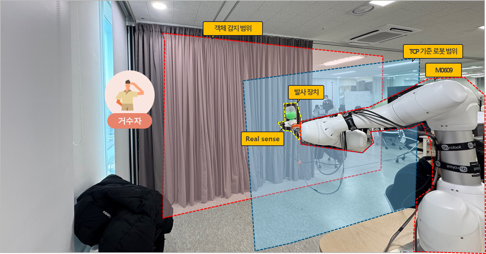
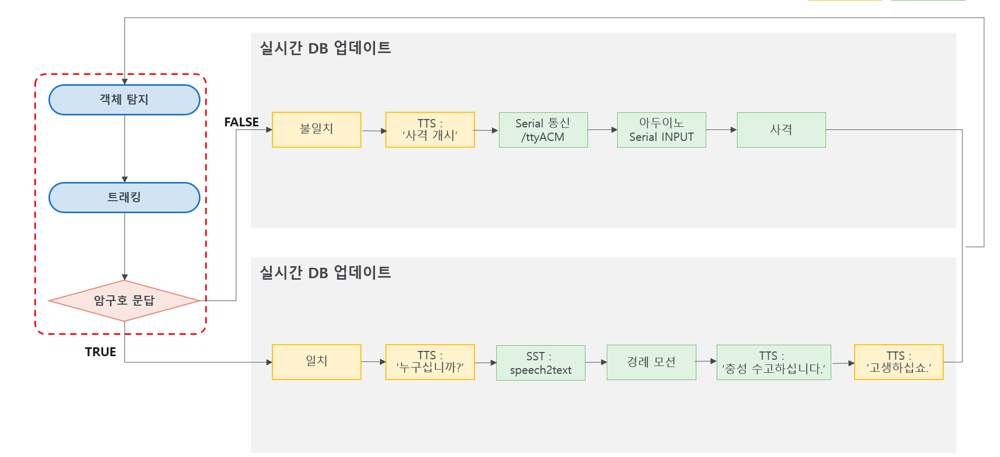

# 경계 시스템 자동화

[](https://youtu.be/Xig3LvbgLYU)
↑ 이미지 클릭 시 데모 영상을 확인할 수 있습니다.

YOLO 기반 영상 인식 결과와 ROS 2 토픽/액션 흐름을 이용해 협동로봇의 추적, 인증, 후속 동작을 제어하는 프로젝트입니다.

이 프로젝트는 카메라 영상에서 대상의 위치를 검출하고, 화면 중심 대비 정규화 오차(`error_norm`)를 계산한 뒤 Doosan 로봇의 TCP 속도 명령(`speedl`)에 반영합니다. 인증 결과에 따라 경례 또는 사격 동작을 실행합니다.

---

## 1. 프로젝트 개요

- 분야: 경계/감시 상황을 가정한 협동로봇 자동화
- 주요 기술: ROS 2 Humble, Python, YOLO, OpenCV, ROS 2 Action, Doosan Robot API, Arduino
- 로봇 기준: Doosan M0609 설정 기준
- 주요 구성:
  - 영상 인식 노드
  - TCP 추종 제어 노드
  - 인증 Action 서버
  - 메인 오케스트레이터 노드
  - 경례/사격 동작 노드
  - Arduino 기반 외부 액추에이터 제어
  - PyQt5 기반 모니터링 UI
  - SQLite 기반 로그 노드

---

## 2. 프로젝트 목표

- 카메라 영상에서 대상을 탐지하고 화면 중심 기준 오차를 계산합니다.
- 정규화된 2D 오차값을 로봇 TCP 속도 제어 입력으로 사용합니다.
- 대상이 일정 조건을 만족하면 `lock_done` 상태를 발생시킵니다.
- `lock_done` 이후 인증 절차를 수행하고, 인증 결과에 따라 작업을 분기합니다.
- 인증 실패 누적 시 `shoot_node`를 통해 로봇 동작과 Arduino 외부 액추에이터 동작을 수행합니다.
- UI와 로그 노드를 통해 영상, 상태, 이벤트 기록을 확인할 수 있도록 구성합니다.

---

## 3. 저장소 구조

```text
Eye-in-Hand-Camera/
├── README.md
├── LICENSE
├── requirements.txt
├── .gitignore
├── arduino/
│   ├── README.md
│   └── actuator_controller.ino
├── data/ (실행 시 자동 생성)
│   └── camera_data/
├── docs/
│   ├── Flow_chart.png
│   └── eye_in_hand.png
└── src/
    ├── cobot2/
    │   ├── cobot2/
    │   ├── launch/
    │   ├── resource/
    │   │   └── weights/
    │   │       ├── day.pt
    │   │       ├── night.pt
    │   │       └── hello_rokey_8332_32.tflite
    │   ├── package.xml
    │   ├── setup.py
    │   └── setup.cfg
    └── cobot2_interfaces/
        ├── action/
        │   └── Auth.action
        ├── CMakeLists.txt
        └── package.xml
```

### 폴더 설명

| 경로 | 설명 |
|---|---|
| `src/cobot2/` | 메인 ROS 2 실행 패키지 |
| `src/cobot2/cobot2/` | ROS 2 노드 소스 코드 |
| `src/cobot2/launch/` | 통합 실행 launch 파일 |
| `src/cobot2/resource/weights/` | YOLO / Wakeword 모델 파일 위치 |
| `src/cobot2_interfaces/` | ROS 2 Action 인터페이스 패키지 |
| `arduino/` | Arduino 기반 SG90 외부 액추에이터 제어 코드 |
| `data/camera_data/` | 실행 중 생성되는 SQLite 로그 DB 위치 |

---

## 4. 프로젝트 구조 기준

이 저장소에서 `Eye-in-Hand-Camera/`는 단일 ROS 2 패키지가 아니라 프로젝트 저장소 루트입니다.

동시에, 저장소 내부에 `src/` 폴더를 두고 있으므로 `Eye-in-Hand-Camera/`를 ROS 2 워크스페이스 루트처럼 사용할 수 있습니다.

역할 구분은 다음과 같습니다.

| 경로 | 역할 |
|---|---|
| `Eye-in-Hand-Camera/` | 프로젝트 저장소 루트 / ROS 2 워크스페이스 루트 |
| `src/cobot2/` | 메인 ROS 2 패키지 |
| `src/cobot2_interfaces/` | ROS 2 Action 인터페이스 패키지 |
| `arduino/` | ROS 2 패키지가 아닌 Arduino 펌웨어 영역 |
| `docs/` | README 이미지 및 문서 자료 |
| `data/` | 실행 중 생성되는 로그 데이터 영역 |

---

## 5. 외부 의존성

이 저장소에는 `doosan-robot2`를 포함하지 않습니다.

Doosan ROS 2 패키지는 저장소 내부의 `src/` 폴더에 별도로 설치합니다.

```bash
cd ~/Eye-in-Hand-Camera/src
git clone -b humble https://github.com/DoosanRobotics/doosan-robot2.git
```

최종 워크스페이스 구조 예시는 다음과 같습니다.

```text
Eye-in-Hand-Camera/
├── README.md
├── LICENSE
├── requirements.txt
├── .gitignore
├── arduino/
├── data/
├── docs/
└── src/
    ├── cobot2/
    ├── cobot2_interfaces/
    └── doosan-robot2/
```

---

## 6. 주요 패키지

### 6-1. `cobot2`

메인 실행 패키지입니다.

| 실행 이름 | 역할 |
|---|---|
| `yolo_camera` | 카메라 영상 기반 대상 탐지, 추적 ID 유지, `error_norm` 발행 |
| `tcp_follow` | `error_norm`을 수신해 Doosan `speedl` 속도 명령으로 변환 |
| `orchestrator` | `lock_done`, 인증, 경례/사격 작업 흐름 제어 |
| `auth_action` | ROS 2 Action 기반 인증 서버 |
| `salute` | 인증 성공 시 경례 동작 수행 |
| `shoot` | 인증 실패 누적 시 사격 동작 수행 및 Arduino 외부 액추에이터 Serial 명령 전송 |
| `safety_monitor` | 로봇 상태 확인 및 안전 이벤트 발행 |
| `follow_ui_node` | PyQt5 기반 영상/이벤트 모니터링 UI |
| `follow_logger_node` | 이벤트 및 이미지 스냅샷 로그 저장 |

### 6-2. `cobot2_interfaces`

ROS 2 Action 정의 패키지입니다.

| Action | 용도 |
|---|---|
| `Auth.action` | 인증 요청, 결과, 피드백 전달 |

---

## 7. 시스템 FLOW



1. 카메라 이미지 토픽에서 영상을 수신합니다.
2. `yolo_camera`가 YOLO 추론을 수행합니다.
3. 추적 기능이 켜져 있으면 Ultralytics `track()`과 `bytetrack.yaml` 설정을 사용합니다.
4. 대상의 중심 또는 마스크 중심 기반 aim point를 계산합니다.
5. aim point와 화면 중심의 차이를 `error_norm`으로 정규화합니다.
6. `tcp_follow`가 `error_norm`을 수신합니다.
7. deadzone, EMA 필터, 속도 제한을 적용한 뒤 `speedl` 명령을 생성합니다.
8. 대상이 기준 오차 이내로 유지되면 `lock_done`이 발행됩니다.
9. `orchestrator`가 `lock_done`을 받아 인증 절차를 시작합니다.
10. 인증 성공 시 `salute`, 인증 실패 누적 시 `shoot` 동작을 실행합니다.
11. `shoot_node`는 Serial 통신으로 Arduino에 외부 액추에이터 명령을 전송합니다.
12. Arduino는 수신한 명령에 따라 SG90 서보모터를 구동합니다.
13. 작업 완료 후 추적 상태를 다시 활성화합니다.

---

## 8. Technical Highlights

### 8-1. 2D Image Error 기반 TCP 추종

본 프로젝트는 카메라 영상에서 계산한 2D 오차를 로봇 TCP 속도 명령으로 변환합니다.

```text
camera image
→ YOLO detection / tracking
→ aim point
→ normalized image error
→ deadzone / EMA filter
→ speedl velocity command
```

### 8-2. Vision / Control 분리

`yolo_camera`는 로봇 좌표를 직접 계산하지 않습니다. 대신 `/follow/error_norm`만 발행합니다.

`tcp_follow`는 영상 처리 내부 구조를 알 필요 없이 `error_norm`을 받아 속도 명령을 생성합니다.

이 구조는 영상 인식 모델 교체와 로봇 제어 파라미터 튜닝을 분리할 수 있다는 장점이 있습니다.

### 8-3. Lock 기반 인증 게이트

대상이 화면 중심 기준으로 일정 조건을 만족하면 `lock_done`이 발행됩니다. 이후 `orchestrator`가 인증 Action을 호출합니다.

```text
TRACK
→ LOCK_DONE
→ AUTH
→ SALUTE or SHOOT
→ TRACK
```

인증 성공 시 경례 동작, 인증 실패 누적 시 사격 동작으로 분기합니다.

### 8-4. 안전 제한 로직

`tcp_follow`에는 다음 제한 로직이 포함되어 있습니다.

- `/follow/enable` 비활성화 시 추종 중지
- target timeout 발생 시 제어 입력 무시
- deadzone 적용
- EMA 필터 적용
- Y/Z 속도 제한
- Base Y/Z 위치 제한
- J4 하한 보호 로직

### 8-5. Arduino 기반 외부 액추에이터 연동

`shoot_node`는 `/dev/ttyACM0` 포트를 통해 Arduino에 Serial 명령을 전송합니다.

```text
shoot_node
→ /dev/ttyACM0
→ Arduino
→ SG90 servo
```

Arduino 펌웨어는 `1` 명령을 수신하면 SG90 서보모터를 지정 각도로 왕복 구동합니다.

---

## 9. 주요 토픽

### Vision / Follow

| 토픽 | 타입 | 설명 |
|---|---|---|
| `/follow/error_norm` | `Float32MultiArray` | 화면 중심 대비 정규화 오차 `[ex, ey]` |
| `/follow/enable` | `Bool` | 추적/추종 활성화 여부 |
| `/follow/lock_done` | `Bool` | 대상 락온 완료 상태 |
| `/follow/annotated_image` | `sensor_msgs/Image` | UI 표시용 주석 이미지 |
| `/follow/ui_event` | `String` | UI/로그용 이벤트 메시지 |

### Orchestrator / Task

| 토픽 | 타입 | 설명 |
|---|---|---|
| `/orchestrator/start` | `String` | 수동 인증 시작 입력 |
| `/orchestrator/trigger` | `Bool` | 외부 트리거 기반 시작 |
| `/orchestrator/status` | `String` | 상태 출력 |
| `/salute_trigger` | `Bool` | 경례 동작 시작 |
| `/salute_done` | `Bool` | 경례 동작 완료 |
| `/shoot_trigger` | `Bool` | 사격 동작 시작 |
| `/shoot_done` | `Bool` | 사격 동작 완료 |
| `/safety/event` | `String` | 안전 이벤트 |

---

## 10. 설치 및 빌드

### 10-1. ROS 2 환경 로드

```bash
source /opt/ros/humble/setup.bash
```

### 10-2. 프로젝트 클론

`Eye-in-Hand-Camera` 저장소 루트를 ROS 2 워크스페이스 루트로 사용합니다.

```bash
cd ~
git clone https://github.com/junss1/Eye-in-Hand-Camera.git
cd ~/Eye-in-Hand-Camera
```

### 10-3. Doosan ROS 2 패키지 설치

```bash
cd ~/Eye-in-Hand-Camera/src
git clone -b humble https://github.com/DoosanRobotics/doosan-robot2.git
```

### 10-4. Python 의존성 설치

프로젝트에서 사용하는 일부 Python 패키지는 pip 설치가 필요할 수 있습니다.

```bash
cd ~/Eye-in-Hand-Camera
pip install -r requirements.txt
```

### 10-5. 환경 변수 설정

STT, 키워드 생성 등 OpenAI API를 사용하는 노드는 `OPENAI_API_KEY`가 필요합니다.

```bash
export OPENAI_API_KEY="your_api_key"
```

또는 로컬 개발 환경에서만 `.env` 파일을 사용할 수 있습니다.

```text
OPENAI_API_KEY=your_api_key
```

### 10-6. rosdep 설치

실제 ROS 2 패키지는 저장소 내부의 `src/` 폴더에 있습니다.

```bash
cd ~/Eye-in-Hand-Camera
rosdep install -r --from-paths src --ignore-src --rosdistro humble -y
```

### 10-7. 빌드

```bash
cd ~/Eye-in-Hand-Camera
colcon build --symlink-install --base-paths src

source install/setup.bash
```

---

## 11. 실행 방법

### 11-1. 통합 실행

```bash
ros2 launch cobot2 cobot2.launch.py
```

현재 launch 파일은 내부 변수 `REAL_SWITCH = True` 기준으로 실제 로봇 모드를 선택합니다.

```python
REAL_SWITCH = True
REAL = {"mode": "real", "host": "192.168.1.100", "port": "12345", "model": "m0609"}
VIRTUAL = {"mode": "virtual", "host": "127.0.0.1", "port": "12345", "model": "m0609"}
```

실제 로봇 IP와 가상/실제 모드 전환 방식은 현장 환경에 맞게 수정해야 합니다.

### 11-2. 개별 노드 실행

```bash
ros2 run cobot2 yolo_camera
ros2 run cobot2 tcp_follow
ros2 run cobot2 auth_action
ros2 run cobot2 orchestrator
ros2 run cobot2 follow_ui_node
ros2 run cobot2 follow_logger_node
ros2 run cobot2 safety_monitor
ros2 run cobot2 salute
ros2 run cobot2 shoot
```

---

## 12. 모델 파일

모델 파일은 `src/cobot2/resource/weights/` 경로에 포함되어 있습니다.

```text
src/cobot2/resource/weights/
├── day.pt
├── night.pt
└── hello_rokey_8332_32.tflite
```

현재 저장소 구조는 위 모델 파일들을 `weights/` 경로에 두고 실행하는 기준입니다.

---

## 13. Arduino External Actuator

외부 액추에이터 제어를 위해 Arduino 기반 SG90 서보모터 제어 코드를 사용합니다.

### 13-1. 저장 위치

```text
arduino/
├── README.md
└── actuator_controller.ino
```

### 13-2. Hardware

| Item | Value |
|---|---|
| Board | Arduino Uno / Nano |
| Servo | SG90 |
| Signal Pin | D9 |
| Baudrate | 115200 |
| Serial Port | `/dev/ttyACM0` |

### 13-3. Serial Command

| Command | 설명 |
|---|---|
| `1` | 서보모터를 지정 각도로 3회 왕복 동작 |
| `HOME` | 서보모터를 기본 위치로 복귀 |

### 13-4. Default Parameters

| Parameter | Value |
|---|---|
| `HOME_ANGLE` | 90 |
| `STEP_DEG` | 40 |
| `HOLD_MS` | 200 |
| `REPEAT_CNT` | 3 |

### 13-5. 동작 개요

```text
ROS 2 shoot_node
→ Serial Communication
→ Arduino
→ SG90 Servo Actuation
```

현재 `shoot_node`는 기본값 기준 `/dev/ttyACM0`, `115200` baud로 Arduino에 `1` 명령을 전송합니다.

---

## 14. Hardware Configuration

실제 사용 환경에 따라 달라질 수 있으나, 코드 기준 주요 전제는 다음과 같습니다.

| 항목 | 내용 |
|---|---|
| Robot | Doosan M0609 기준 설정 |
| Robot API | `DSR_ROBOT2` |
| Camera Input | ROS 2 `sensor_msgs/Image` 토픽 |
| Default Color Topic | `/camera/camera/color/image_raw` |
| Default IR Topic | `/camera/camera/infra1/image_rect_raw` |
| UI | PyQt5 |
| Logging | SQLite |
| External Device | Arduino 기반 SG90 서보 액추에이터 (`/dev/ttyACM0`, 115200 baud) |

---

## 15. License

이 프로젝트는 MIT License를 사용합니다. 자세한 내용은 `LICENSE` 파일을 참고하십시오.

---

## 16. 주의사항

- `doosan-robot2`는 외부 의존성으로 관리하는 것을 권장합니다.
- 실제 로봇 실행 전 로봇 IP, TCP/Tool 설정, 안전 정지 조건을 현장 환경에 맞게 확인해야 합니다.
- `cobot2.launch.py`의 실제/가상 모드 전환은 현재 launch argument가 아니라 코드 내부 변수로 관리됩니다.
- Arduino 연결 포트(`/dev/ttyACM0`)는 실행 환경에 따라 달라질 수 있으므로 실제 장치 연결 후 확인해야 합니다.
- Arduino 펌웨어는 ROS 2 패키지가 아니므로 `colcon build` 대상이 아닙니다.

---
